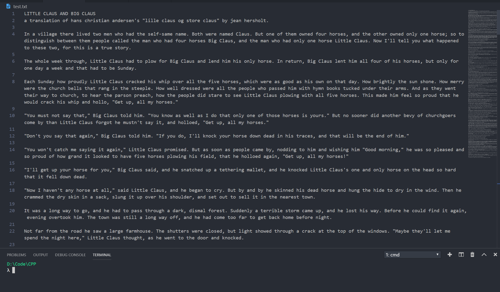
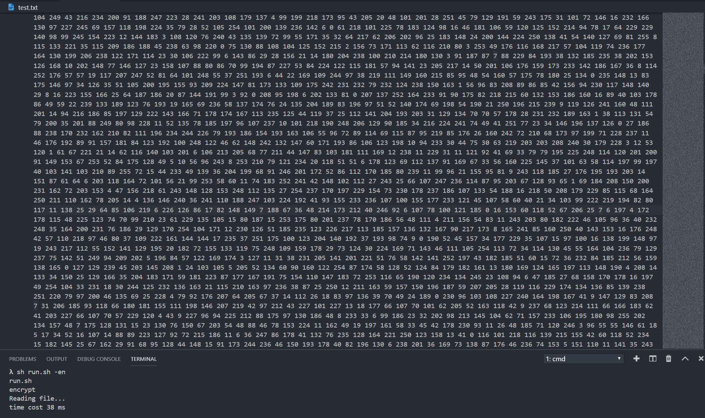
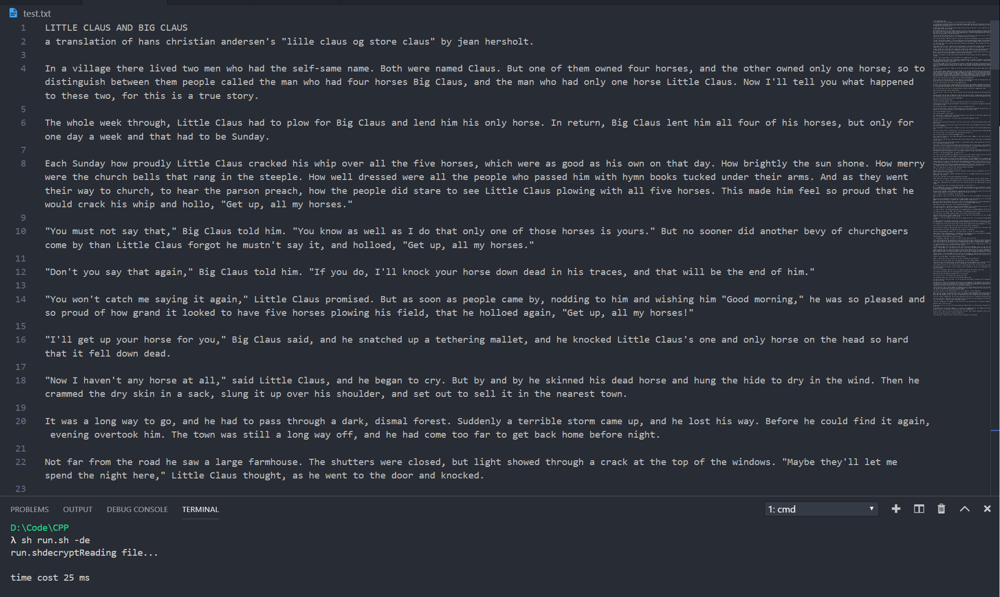
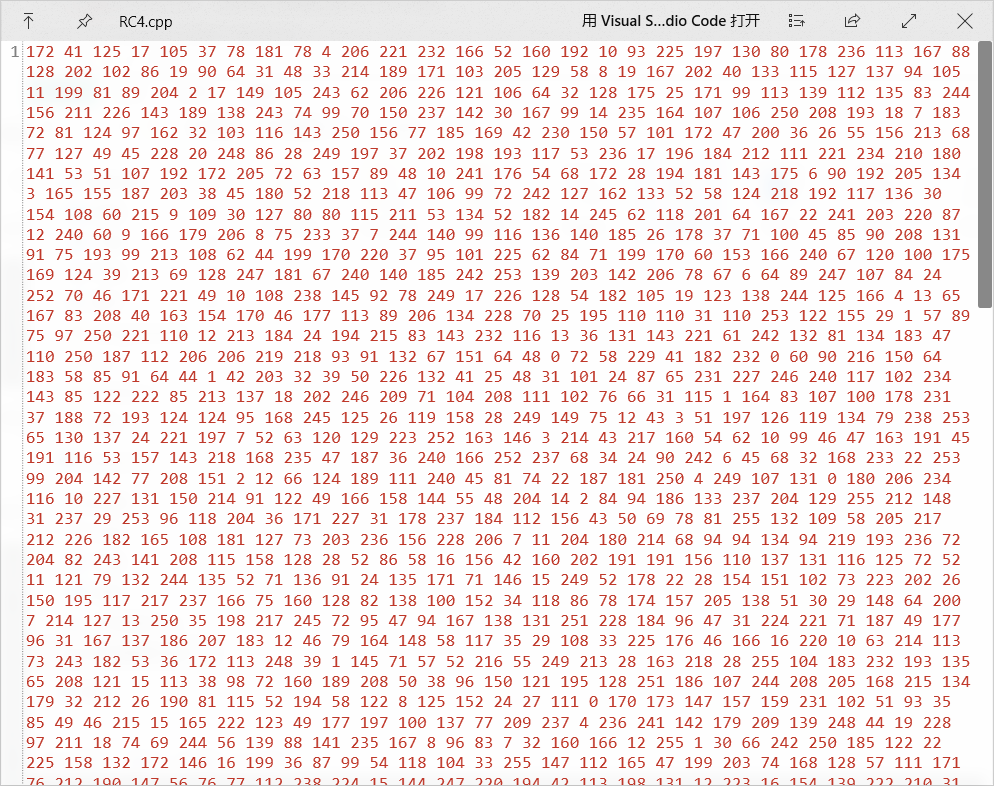
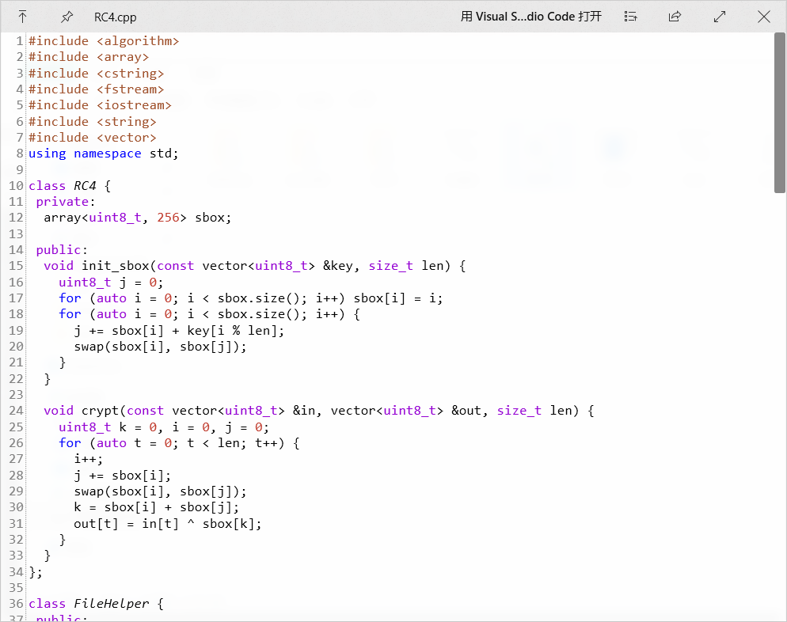

# RC4 加密算法的简易实现

### 1、实验背景

加密算法是数据加密的核心，常见的加密算法有对称加密算法和非对称加密算法。其中，对称加密算法加密和解密所需要的密钥是相同的，而非对称加密算法加密密钥和解密密钥不同。

> 常见的对称加密算法有`des` 、`AES` 等，而非对称加密则是以`RSA`、`ECC`等为主流。

#### 流密码：

流密码是一种基于加密算法的密码，其加密和解密的过程都是使用的伪随机密钥流来作为密钥。其中明文的数据会和密钥流的数据按照位数相对应进行加密，从而得到一个密文的数据流。通常来说，数据是按照位进行加密的。

#### RC4:

(来源于[wiki](https://zh.wikipedia.org/zh-hans/RC4)) RC4是一种流加密算法，其密钥的长度可以改变。它在加解密的过程中使用相同的密钥，故属于对称加密算法。RC4是有线等效加密中采用的加密算法，也曾经是TLS中可采用的算法之一

### 2、实验原理

* RC4是基于伪随机数生成器的亦或运算实现的。它的密钥的长度是可以改变的(1~255字节)。

* RC4基于了两个子算法实现，一个是KSA算法，用于提供种子密钥生成S盒(进行实际加密的密钥序列)。而另一个，则是PRNG算法，用于混乱S盒，并对每一个明文单元(字节)进行加密。

* 由于基于对称加密，并没有对消息的长度进行压缩，故在原本存在的字符串的基础上面进行基本的替换即可。

基于上述的步骤，我们实现RC4实际上只需要实现RC4的两个子算法就可以了。

### 3、设计

1、首先我们考虑第一个子算法。其实它的原理很简单，就是基于给定的种子密钥生成我们所需要的S盒，这个过程并不会包含S盒进行置换的过程，所以其实只进行了初始化。基于老师给定的伪代码，我们实现了如下的init_sbox函数。


**原理图：**


**代码设计：**

```c++
  void init_sbox(const vector<uint8_t> &key, size_t len) {
    uint8_t j = 0; //unsigned char 的宏类型，因为最大为255，所以不用考虑模运算
    for (auto i = 0; i < sbox.size(); i++) sbox[i] = i;
    for (auto i = 0; i < sbox.size(); i++) {
      j += sbox[i] + key[i % len];
      swap(sbox[i], sbox[j]);
    }
  }
```


第二个子算法需要对明文进行加密同时不断的置换s盒里面的元素。这个根据逻辑图可能会觉得实现似乎比较复杂，但是实际上还是相对比较简单的。其中主要分为三个步骤

* 更新i和j的值，并交换S[i]和S[j]
* 根据i和j，S[i]和S[j]获取k
* 将S[k]的值和当前位置的明文相亦或


**原理图：**


**代码设计：**

```c++
  void crypt(const vector<uint8_t> &in, vector<uint8_t> &out, size_t len) {
    uint8_t k = 0, i = 0, j = 0;//unsigned char 的宏类型，因为最大为255，所以不用考虑模运算
    for (auto t = 0; t < len; t++) {
      i++;
      j += sbox[i];
      swap(sbox[i], sbox[j]);
      k = sbox[i] + sbox[j];
      out[t] = in[t] ^ sbox[k];
    }
  }
```


**注：这里为了方便代码的可读性，和后期代码的维护与修改。本人将两个函数封装到了自定义的类RC4中。**


### 4、测试验证

由于这几天在上F#的课，文件流的处理较多，所以受F#的影响，突发奇想，做了一个基于RC4的文本加密程序。其实现的逻辑也是非常的简单，就是使用文件流读取文件，然后使用RC4加密后，复写到原本的文件上面。其中密钥通过命令行参数传入。

**1**、首先我设计了一个FileHelper类用于统一管理文件的读取和写入。接口如下(实现见具体文件)

```c++
vector<char> readPlain(const char *filepath) {}

vector<char> readCiphertext(const char *filepath, int *len) {}

void writeCiphertext(vector<int> msg, const char *filepath) {}

void writePlaintext(vector<uint8_t> msg, const char *filepath) {}
```


**想必老师看见这里肯定会觉得很蠢，因为RC4是基于对称加密的，也就是说明文和密文是相互等价的，说白了就是文件的读取和写入分别只需要一个方法就行了。**

其实我最初确实是这么设计的，但是无奈C++(或C)太坑爹了，对于ASCII码是0的密文，直接就当\0了。也就是说，对于加密好了的密文，如果直接通过文件流写入到磁盘，就很有可能出现很多不可描述的问题，比如文件流的写入提前结束或者文本的读取提前结束。另外，对于需要统计的文本长度，也很有可能会因为提前出现的\0而导致偏短。

所以为了确保整体加解密的体验，我最终还是将密文转化成ASCII码进行写入的，至少这样不会出现莫名其妙的换行和一些很辣眼睛的怪异符号。


**2**、其次，由于要编译成为一个可以执行的程序，并且具有兼容性，所以，必须要考虑命令行传参。这里只做简单描述，详细代码请查看Main方法

* Main方法接受三个参数。Argv[1]为操作指令 -en(加密) 和 -de(解密)。（这里问什么要分开，因为对于读取了的文本处理上有区别，密文需要把ASII码字符串分割并生成ASCII码）。
  
* Argv[2]为文件，即我们需要加密文件对象。
  
* Argv[3]为我们输入的密钥

​    

#### 测试：

1、尝试加密3W字的安徒生童话

**加密前：**




**加密后：**



加密的时间是38ms。


**尝试解密：**



解密时间是25ms，和加密时间相似。


2、尝试一下我加密我自己。(下面输出的是加密后密文的ASCII编码)

加密：


查看RC4.CPP：



解密：


再次查看RC4.cpp（再次编译能过，这里就不放图了）



**结论：一个简易的RC4算是基本完成了。**


3、当然仅仅是这样的验证还无法确定我们的消息和之前完全是吻合的，因为如果产生了多余的空格的话，既不容易看出来，对于代码的编译也同样会通过。所以我编写了一个计算文本内容的hash的工具(具体实现参考了JAVA的``hashCode()`` 方法，但是比较简陋)。

实现如下：

```c++
void myHash(vector<char>& content) {
  int hash = 0;
  for (char ch : content) {
    hash = (31 * hash + ch) & INT32_MAX;
  }
  cout << endl << "hash value is: " << hash << endl;
}
```

运行结果如下：


连续加密，解密再hash，结果如下：


**结论：**我们的文件被一字不差的加密(解密)了，也就是说，RC4的算法编写成功。


#### 思考：

那么对于非文本文件呢？于是这里我们创建了一个RC4_Copy.exe文件来用于实验。

加密：(仍然一堆乱码)


运行果然报错了hhh:


尝试解密：（失败了hhhhh）


**失败原因分析**：因为exe文件并不是以字节的形式存储的，所以对exe加密的时候应当按位读取并加密，按字符读取就会出现不可描述的错误，当然这个就涉及到我的知识盲区了。或许按二进制读取并换一种流密码可能会成功，不过我们这里主要研究RC4所以就不过多的描述。差不多也算是RC4的一种局限把。


### 5、结论

#### 复杂度分析：

个人觉得RC4还是不复杂的(hhh开个玩笑)，因为RC4不是传统意义上面的算法，所以描述复杂度可能会受多方因素的影响，这里我们排除S盒的生成(最长就255)位，可以看到RC4在加密的过程中也仅对消息进行了一次遍历而已，也就是说其时间复杂度位O(n)，另外遍历的同时也仅仅在原来的明文基础上进行了单纯的亦或操作，所以空间复杂度也仅为O(n)。由此可见，RC4的效率是非常高效且可观的（相较于分组密码）。

#### 实用性分析：

个人觉得，RC4在通信的时候对于文本进行加密还是非常实用的。比如在常用的HTTP请求中，用来加密报文，在普通的聊天中，用于加密通讯信息。从之前加密近3W字的安徒生童话时间仅仅在毫秒级可见，已经非常快了。

#### RC4安全性分析：

- 弱密钥：会产生重复的密钥流，一旦子密钥序列出现了重复，密文就有可能被破解。
- 无效初始置换 `j = (j + Sbox[i] + T[i]) % 256` 取 `(j+T[i])mod 256 ≡ 0` 即`T[i]=[0,0,255,254,253,...,2]` 这样的情况下 sbox完全不会被搅乱 ，都是无效替换。
- WEP应用过程中的问题，特定情况下能逆转RC4加解密过程，从而获取密钥。
- 难以抵抗已知明文攻击。

#### 2019.8.13补充：

* 前一段时间看了一些密码学的mooc，才知道RC4是一种比较老旧的加密算法，缺陷蛮多的，于是对前面的内容在做一些补充。
* 应用
  * HTTPS协议
  * WEP 协议(不过好像已经被淘汰了)
* 缺陷：
  * 最开始的256位随机密钥流的字符概率有一定的偏移，比如第二个字节出现0的概率是2/256而不是1/256。如果这个bit是0的话，那么这个字节就不会被加密。不过可以从密钥流的第257位开始进行加密。
  * RC4在输出了较长的密钥流之后(mooc中描述的是几个G的byte后)，伪随机密钥流中出现00的概率将会提高，甚至课中给出了偏移量为(1/256)^3。这个特征间接的说明了当前密钥流并不是一个真正的随机密钥流，而是基于一个生成器产生的伪随机序列，对于尝试分析密码的人来说是一个很好的提示(因为真正的随机且与明文等长的密文序列是绝对安全的，当然这个我也不是很清楚，只知道是香农证明的)。
  * 基于上面两个因素，导致RC4很容易被差分攻击，即分析密钥流中容易出现偏差的位置，从而破解部分明文。

#### RC4潜在运用的猜想：

最近在研究前端开发，发现作为浏览器脚本语言的JavaScript代码是直接或间接运行在HTML里面的，也就是说对于攻击者来说他们是很容易拿到JS的实现逻辑的，如果一旦被攻击者弄明白了前端的脚本的内容，那么很有可能后端的API就被暴露，攻击者可以向API接口进行DDOS，甚至尝试通过SQL注入来入侵后端数据库。

现在主流的解决方案就是做代码混淆，通过WebPack等构建工具将结构化的JavaScript代码打包成一个可读性极差的JS文件从而增大破解者的攻击难度。但是对于攻击者来说可以通过分析程序运行的堆栈来筛选出有用的信息(雾，我不同逆向工程，猜测应该是这样)。

基于浏览器通过HTTP协议通信的原理，我们可以通过对浏览器客户端的cookie或者session先确保当前通信的浏览器是可靠的，再执行本地的JS脚本。具体实现是在前端访问HTML的时候，服务端发送带有通过RC4S加密的JS的HTML文件，只有当后端确定了浏览器的身份，才会把通过非对称加密后的RC4密钥发送过来。前端(客户端浏览器)拿到密钥后，开始对JS脚本进行解密。

由于JavaScript是解释性的语言，也就是一行一行的进行读取的，所以RC4这种伪随机密钥流对于其解密的兼容性是非常好的。比如说可以直接把解密的工作丢给浏览器的JavaScript引擎，引擎解密一行代码，读取一行代码，这样的效率非常高并且非常的安全。


